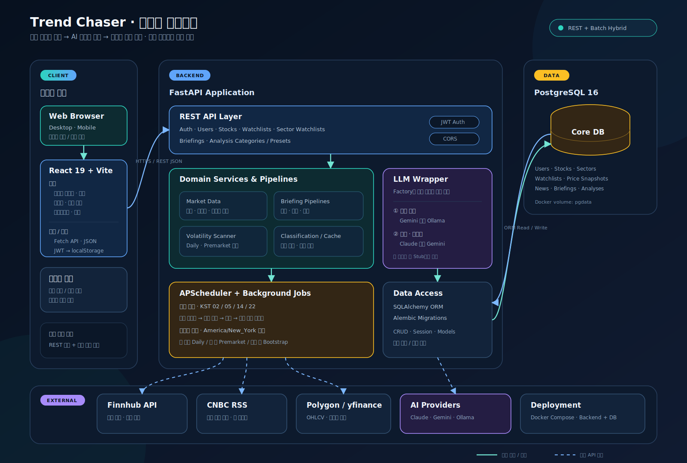

# Trend Chaser 시스템 아키텍처

이 그림은 현재 코드에 구현된 구조를 기준으로 작성했다.

- 클라이언트: React 19 + Vite, Fetch API, JWT localStorage 저장
- 서버: FastAPI REST API, SQLAlchemy, Alembic
- 자동화: APScheduler 정기 브리핑 갱신 및 변동성 스캔
- 데이터: PostgreSQL 16
- 외부 데이터: Finnhub(종목 시세·기업 뉴스), CNBC RSS(시장 뉴스 주 공급원), Polygon.io 및 yfinance(변동성 데이터)
- AI: Factory 기반 Claude, Gemini, Ollama 선택 및 Stub fallback
- 배포: Docker Compose로 FastAPI와 PostgreSQL 구성

실시간 갱신은 WebSocket이 아니라 REST 재조회와 비동기 작업 상태 폴링으로 표현했다.
